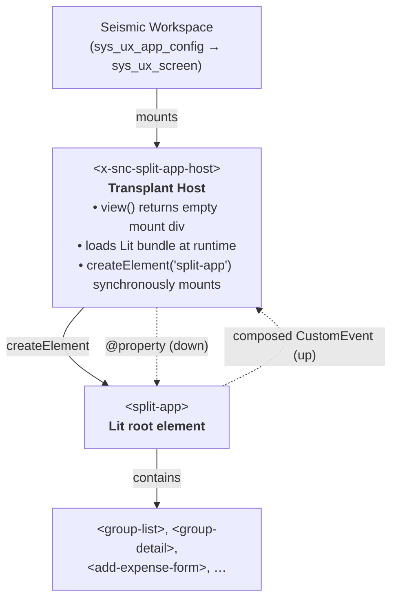

# SplitApp

A split-expense tracking application (inspired by Splitwise) built for ServiceNow. Groups of users can track shared expenses, split costs across members using multiple strategies, and record settlements to clear balances.

## Contents

- [Features](#features)
- [Tech Stack](#tech-stack)
- [Project Structure](#project-structure)
- [Deploying to a ServiceNow PDI](#deploying-to-a-servicenow-pdi)

  - [PDI Deployment Method 1: Background Scripts - Not Recommended](#deployment-method-1-not-recommended-fallback-only--deploy-using-the-servicenow-background-scripts-ui)
  - [PDI Deployment Method 2: @servicenow/sdk 4.7.0](#method-2-deploy-using-servicenowsdk-470-now-sdk)
  - [PDI Deployment Method 2: Lessons Learned](#lessons-learned-deploying-lit-on-servicenow-australia-servicenowsdk-470)

- [Running UI Locally (UI Development)](#running-locally-development)
- [Deploying to a Local GLL Instance (Full Stack Development)](#deploying-to-a-local-gll-instance)
- [Deploying the Seismic Workspace](#deploying-the-seismic-workspace)

  - [Architecture: Transplant Host](#architecture-transplant-host)
  - [Approaches considered](#approaches-considered)

- [Acceptance Criteria Walkthrough](#acceptance-criteria-walkthrough)
- [Troubleshooting](#troubleshooting)
- [Data Model](#data-model)

## Features

### Group Management
- Create groups with a name, optional description, and configurable base currency (USD/EUR/INR/GBP)
- Duplicate group names are rejected (case-sensitive check server-side)
- Group creator is automatically assigned the Admin role
- Admins can remove members (blocked if member has outstanding balances) and **delete the group entirely** (cascades to all associated transactions)
- Users see only the groups they belong to

### Expense Management
- Four split strategies:
  - **Equal** — auto-calculated per member
  - **Exact** — user specifies each member's amount
  - **Percentage** — user specifies each member's percentage; amounts auto-calculated
  - **Shares** — user assigns integer units; amounts auto-calculated
- Categories: Food & Drink, Travel, Utilities, Entertainment, Other
- Optional notes (up to 100 characters)
- Optional receipt image upload
- The payer or a group Admin can edit or delete an expense, provided no shares have been settled

### Balance & Settlement
- Simplified net balance view: bidirectional debts are netted (if A owes B $30 and B owes A $10, only A owes B $20 is shown)
- Record settlements specifying recipient, amount, date, and payment method
- Settlements are applied to the oldest unsettled shares first (FIFO)
- Partial settlements supported — a share is tracked via `settled_amount`
- Warning if a settlement exceeds the outstanding balance
- Personal dashboard across all groups showing total owed and total owing

### Security
- Membership-gated: all REST endpoints validate the caller belongs to the group
- Only the expense payer or a group Admin can mutate an expense
- Only Admins can add, remove, or delete members and groups
- Duplicate group names are rejected (409 Conflict)

## Tech Stack

| Layer | Technology |
|---|---|
| **Runtime** | Node v22.14.0, npm 11.4.2 |
| **Root workspace** | `concurrently@^9.2.1` (`/package.json`) |
| **Frontend** | [Lit](https://lit.dev) `^3.3.3` (`frontend/`) — reactive web components |
| **Styling** | [Tailwind CSS](https://tailwindcss.com) `^4.3.0` (`frontend/`) — utility-first CSS |
| **Bundler** | [Vite](https://vitejs.dev) `^8.0.13` (`frontend/`) — dev server & production builds |
| **Now Experience shell** | [Seismic](https://docs.servicenow.com/csh?topicname=seismic-overview.html) custom element `x-snc-split-app-host` (`seismic-wrapper/`) — Transplant Host that loads the Lit bundle at runtime |
| **Seismic build** | `@servicenow/cli@^24.0.1` + `@servicenow/ui-core@^24.1.1` + `@servicenow/ui-renderer-snabbdom@^24.1.1` (`seismic-wrapper/`) — `snc ui-component build && snc ui-component deploy` |
| **Backend** | ServiceNow scoped application (scope `x_{company_code}_split`) |
| **Data** | Custom ServiceNow tables — `x_{scope}_group`, `x_{scope}_membership`, `x_{scope}_expense`, `x_{scope}_share`, `x_{scope}_settlement` |
| **API** | ServiceNow REST API with Script Includes for business logic |
| **Workspace metadata** | `sys_ux_app_config`, `sys_ux_screen`, `sys_ux_screen_type`, `sys_ux_macroponent`, `sys_ux_app_route` (defined in `sn-sdk/src/fluent/workspace/`) — the Seismic Now Experience workspace wrapper |
| **Deployment (Background Script)** | `setup-bg-script.js` (GlideRecord) + `deploy.js` (Node.js) |
| **Deployment (SDK)** | `@servicenow/sdk` `^4.7.0` (`sn-sdk/`) — fluent TypeScript → `now-sdk build && now-sdk install` |

## Project Structure

```
split-app/
├── frontend/                        # Lit + Vite SPA
│   ├── scripts/
│   │   └── wrap-ui-page.cjs         # UiPage XML wrapper (legacy)
│   ├── src/
│   │   ├── main.ts                  # Entry point (Shadow DOM + Tailwind CSS injection via ?inline)
│   │   ├── split-app.ts             # Root component (view router)
│   │   ├── store/store.ts           # Reactive state (StoreController, singleton pattern)
│   │   ├── services/api.ts          # Fetch-based API client (X-UserToken, discoverApiBase)
│   │   ├── index.css                # Tailwind v4 theme with SN color palette
│   │   ├── vite-env.d.ts            # Vite type declarations (includes *.css?inline)
│   │   └── components/
│   │       ├── user-dashboard.ts
│   │       ├── group-list.ts             # Create group with currency + description + toast
│   │       ├── group-detail.ts           # Member management + delete group + toast
│   │       ├── balance-summary.ts
│   │       ├── add-expense-form.ts       # Date picker, receipt upload, notes 100
│   │       ├── expense-list.ts
│   │       ├── record-settlement-form.ts
│   │       └── date-picker.ts            # Custom date picker (month/year dropdowns, 2000+)
│   ├── index.html
│   ├── tsconfig.json
│   ├── vite.config.ts               # BUILD_MODE conditional + strip-css-at-property plugin
│   └── package.json                 # Added build:split script
│
├── scripts/
│   ├── setup-scope.js               # Detect company code, rename scope prefix across all files (incl. seismic-wrapper/)
│   ├── build-seismic.cjs            # NEW — Builds Seismic wrapper with SN_SPLIT_VERSION inlined from .split-bundle-version
│   ├── deploy.js                    # Deploy/update script includes and API (Method 1)
│   └── copy-bundle.js              # NEW — Copies frontend build → sn-sdk/src/client/
│
├── setup-bg-script.js               # Bootstrap script (for Method 1)
├── setup-bg-script.min.js           # Minified version of bootstrap
│
├── sn/                               # ServiceNow backend artifacts (JSON/JS for Method 1)
│   ├── app.json
│   ├── sys_db_object/               # Custom table definitions (5 tables)
│   ├── sys_script_include/          # Business logic (5 script includes)
│   ├── sys_ws_definition/           # REST API definition
│   └── sys_ws_operation/            # Per-endpoint scripts (14 operations)
│       ├── get_groups.js
│       ├── post_groups.js
│       ├── get_group.js
│       ├── delete_group.js              # Admin group deletion with cascade
│       ├── post_members.js              # Accepts user_name or user_sys_id
│       ├── delete_member.js
│       ├── post_expenses.js
│       ├── get_expenses.js
│       ├── get_expense.js
│       ├── put_expense.js
│       ├── delete_expense.js
│       ├── get_balances.js
│       ├── post_settlements.js
│       └── get_user_dashboard.js
│
├── sn-sdk/                           # @servicenow/sdk ^4.7.0 fluent project (Method 2)
│   ├── now.config.json
│   ├── package.json
│   ├── tsconfig.json                 # Root SDK tsconfig
│   ├── scripts/
│   │   └── build-frontend.cjs       # Builds Vite frontend → client/ JS + HTML, strips @property CSS, writes .split-bundle-version
│   ├── src/
│   │   ├── client/                  # Generated frontend files (gitignored)
│   │   │   ├── split_app_main.jsx       # Lit bundle (sys_ui_script source)
│   │   │   └── index.html               # HTML shell with inline CSS (sys_ui_page source)
│   │   ├── keys.now.ts              # Type-safe logical IDs
│   │   ├── fluent/
│   │   │   ├── index.now.ts         # Entry point (imports all definitions)
│   │   │   ├── declarations.d.ts       # *.html module declaration
│   │   │   ├── ui-pages/
│   │   │   │   ├── split_app.now.ts     # UiPage fluent def (imports client/index.html)
│   │   │   │   └── split_app.module.now.ts  # sys_app_module — navigator entry for the UiPage
│   │   │   ├── workspace/           # NEW — Now Experience workspace wrapper (Transplant Host)
│   │   │   │   ├── app-config.now.ts    # sys_ux_app_config (workspace root)
│   │   │   │   ├── app-route.now.ts     # sys_ux_app_route (URL → screen)
│   │   │   │   ├── screen.now.ts        # sys_ux_screen (single Home screen)
│   │   │   │   ├── screen-type.now.ts   # sys_ux_screen_type (chrome style)
│   │   │   │   └── macroponent.now.ts   # sys_ux_macroponent (composition → x-snc-split-app-host)
│   │   │   ├── tables/              # Fluent table definitions (5 tables)
│   │   │   ├── script-includes/     # Fluent ScriptInclude wrappers (5 script includes)
│   │   │   ├── rest-apis/           # Fluent REST API route definitions
│   │   │   ├── generated/           # Auto-generated sys_id mappings
│   │   │   └── tsconfig.json        # Fluent tsconfig
│   │   └── server/
│   │       ├── script-includes/     # Server-side JS (referenced by fluent definitions)
│   │       └── tsconfig.json        # Server tsconfig
│   ├── target/                      # Build artifact (.zip)
│   └── dist/                        # SDK build output
│
├── seismic-wrapper/                  # NEW — Seismic custom-element wrapper (Transplant Host)
│   ├── now-ui.json                  # Component descriptor: tag, label, icon, scope
│   ├── package.json                 # @servicenow/ui-core 24.1.1, @servicenow/cli 24.0.1
│   ├── tsconfig.json
│   └── src/
│       └── x-snc-split-app-host/
│           ├── index.tsx            # Transplant Host: mounts <split-app> at runtime
│           └── styles.scss
│
├── deploy.js                        # Method 1 deploy script
├── .gitignore                       # Includes .env, sn-sdk/.env, sn-sdk/src/client/
└── package.json                     # Root workspace (concurrently)
```

### REST API Endpoints

All under the discovered `base_uri` (e.g., `/api/x_{company_code}_split/x_{company_code}_split/`):

| Method | Path | Description |
|---|---|---|
| `GET` | `/groups` | List groups for the current user |
| `POST` | `/groups` | Create a new group (rejects duplicate names with 409) |
| `GET` | `/groups/{groupId}` | Get group detail with members |
| `DELETE` | `/groups/{groupId}` | Delete group with cascade (admin only) |
| `POST` | `/groups/{groupId}/members` | Add a member (admin only; accepts `user_name` or `user_sys_id`) |
| `DELETE` | `/groups/{groupId}/members/{userId}` | Remove a member (admin only) |
| `GET` | `/groups/{groupId}/expenses` | List all expenses for a group |
| `POST` | `/groups/{groupId}/expenses` | Create an expense |
| `GET` | `/groups/{groupId}/expenses/{expenseId}` | Get expense detail with shares |
| `PUT` | `/groups/{groupId}/expenses/{expenseId}` | Update an expense |
| `DELETE` | `/groups/{groupId}/expenses/{expenseId}` | Delete an expense |
| `GET` | `/groups/{groupId}/balances` | Get net balances between members |
| `POST` | `/groups/{groupId}/settlements` | Record a settlement |
| `GET` | `/user/dashboard` | Get personal dashboard summary |

## Deploying to a ServiceNow PDI

### What is a PDI?

A Personal Developer Instance (PDI) is a free ServiceNow sandbox for development. You can request one at [developer.servicenow.com](https://developer.servicenow.com).

### Prerequisites

- A ServiceNow PDI (e.g., `https://dev123456.service-now.com`)
- Admin credentials for the instance
- Node.js >= 20 (tested with v22.14.0), npm (tested with 11.4.2)

### Deployment Method 1 (not recommended, fallback only): Deploy using the ServiceNow Background Scripts UI 

Deployment is a two-step process:

1. **One-time bootstrap** — run `setup-bg-script.js` in the ServiceNow Background Scripts UI to create tables, fields, choices, API definition, and all REST operations via server-side `GlideRecord` (bypasses PDI business rules that block REST API creation of `sys_db_object` and `sys_ws_operation`).
2. **Deploy updates** — run `deploy.js` to update script includes and patch operation scripts with the latest code (idempotent, safe to re-run).

#### Step 1: Install Node dependencies

```bash
npm install
cd frontend && npm install && cd ..
```

#### Step 2: One-time bootstrap (Background Script)

PDIs restrict REST API operations on `sys_db_object`, `sys_dictionary`, and some `sys_ws_operation` records. The bootstrap runs as a server-side script via ServiceNow's Background Scripts UI, using `GlideRecord` directly to bypass these restrictions.

1. Open your instance: `https://dev123456.service-now.com`
2. Navigate to **System Definition → Scripts – Background** (or visit `/sys.scripts_background.do`)
3. Open `setup-bg-script.js` from the project root (this often proves to be too big for the GUI so you may use `setup-bg-script.min.js`)
4. Copy the entire file contents
5. Paste into the Script field
6. Click **Run script**
7. Check the **System Log** (`/syslog.do`) for output lines prefixed with `=== Split App Bootstrap ===`

The bootstrap creates:
- Application (`x_split` scope)
- 5 custom tables: `x_split_group`, `x_split_membership`, `x_split_expense`, `x_split_share`, `x_split_settlement`
- All dictionary fields and choice records
- Web service definition (`split_api`)
- All 14 REST API operations

#### Step 3: Deploy script includes and API updates

After the bootstrap completes, run `deploy.js` to upload the latest business logic and operation scripts:

```bash
node deploy.js https://dev123456.service-now.com admin your-password
```

Or via npm:

```bash
npm run deploy -- https://dev123456.service-now.com admin your-password
```

What gets updated:
- **Script includes**: `SplitUtils`, `BalanceCalculator`, `ExpenseManager`, `SettlementProcessor`, `SetupApp`
- **Web service definition**: `split_api` (path, active flag)
- **REST operations**: Scripts for all 14 endpoints

This step is **idempotent** — re-running it patches existing records without duplication.

#### Step 4: Verify the REST API

`deploy.js` automatically discovers the `base_uri` from the web service definition. It prints the API base path at the end. Use it to test:

```bash
curl -s --user admin:your-password \
  "https://dev123456.service-now.com/api/{instance_id}/x_split/user/dashboard"
```

Or discover it dynamically:

```bash
API_BASE=$(curl -s --user admin:your-password \
  "https://dev123456.service-now.com/api/now/table/sys_ws_definition?sysparm_query=name=split_api&sysparm_fields=base_uri" \
  | python3 -c "import sys,json; print(json.load(sys.stdin)['result'][0]['base_uri'])")

curl -s --user admin:your-password \
  "https://dev123456.service-now.com$API_BASE/user/dashboard"
```

Expected response (with your session user):

```json
{"user_id":"...","groups":[],"totals":{"you_are_owed":"0.00","you_owe":"0.00"}}
```

#### Step 5: Deploy the frontend

**Option A: Serve from Vite dev server (development)**

```bash
cd frontend
VITE_SN_INSTANCE=https://dev123456.service-now.com npm run dev
```

Open `http://localhost:5173` in your browser. Log in to your PDI in another tab first so the session cookie is available.

**Option B: Deploy as a UI Page (SDK build)**

Use the SDK build pipeline to create a UiPage + external `sys_ui_script` (recommended — avoids Jelly XML parse issues):

```bash
cd sn-sdk && npm run deploy:all
```

This builds the frontend via Vite, extracts the JS and CSS into separate client files, and compiles + installs the SDK fluent definitions. The frontend is served as a static `sys_ui_script` (bypasses Jelly parser) referenced from a thin UiPage HTML shell.

Access at: `https://dev123456.service-now.com/x_{scope}_split_app.do`

**Option C: Serve via Service Portal**

1. Go to **Service Portal → Widgets**
2. Create a new widget and embed the Lit app as a single-page widget

#### Step 6: Verify the full app

1. Open the app (dev server, UI Page, or Service Portal)
2. Create a group
3. Add other users (find their sys_ids in **User Administration → Users**)
4. Add an expense with an equal split
5. Check the balances
6. Record a settlement
7. Verify the dashboard shows correct totals

#### Re-deploying after code changes

When you modify script includes or operation scripts, just run step 3 again:

```bash
npm run deploy -- https://dev123456.service-now.com admin your-password
```

The bootstrap (step 2) only needs to be run once per instance.

### Method 2: Deploy using @servicenow/sdk 4.7.0 (now-sdk)

The ServiceNow SDK compiles fluent TypeScript definitions (`.now.ts` files) into an installable package and deploys it to your instance. Supports deployment to both a local GLL instance and a remote PDI.

**When to use Method 2 vs Method 1:**

| Factor | Method 2 (SDK) | Method 1 (Background Script) |
|--------|----------------|------------------------------|
| First-time setup | Requires plugin checks | Just paste and run |
| Re-deploy speed | `now-sdk build && install` in seconds | `deploy.js` in seconds |
| Server requirements | Needs `sn_glider` + `sn_appclient` plugins | Works on any PDI |
| Instance compatibility | Australia — Zurich (v4.x) | Any release |
| Scope prefix restriction | Must match `glide.appcreator.company.code` | No restriction |
| Local GLL support | Full support via env vars | Requires manual URL config |

#### Prerequisites

- Node.js >= 20 (tested with v22.14.0), npm (tested with 11.4.2), admin credentials for the target instance
- **ServiceNow IDE plugin** (`sn_glider`) v4.1.1+ installed on the instance ([ServiceNow Store](https://store.servicenow.com/sn_appstore_store.do#!/store/help?article=com.servicenow.ide))
- **Scoped App Client** (`sn_appclient`) v29.0.4+ active on the instance
- The app scope prefix must match your instance's `glide.appcreator.company.code` (handled automatically by `setup-scope.js`)

#### Pre-flight verification

Run these checks on your instance (local or PDI) to confirm compatibility:

**1. Check the release — SDK v4.x requires Australia or later**

```sql
-- sys_properties: `glide.product.version`
-- Should show `Australia`, `Zurich`, or later
```

**2. Verify the ServiceNow IDE plugin is installed**

Navigate to **System Applications → All Available Applications** (or `sys_store_app.do`) and search for `ServiceNow IDE`. The version must be 4.1.1 or later.

**3. Verify the Scoped App Client is active**

```sql
-- Via REST:
GET /api/now/table/sys_plugins?sysparm_query=name=com.glide.appclient
```

#### Step 1: Run the scope setup script

```bash
node scripts/setup-scope.js https://dev123456.service-now.com admin 'your-password'
# Or for local GLL:
node scripts/setup-scope.js http://localhost:8080 admin admin
```

#### Step 2: Set up the SDK project

```bash
cd sn-sdk && npm install
```

#### Step 3: Authenticate

**Option A: OS keychain (interactive, one-time per instance)**

```bash
# For PDI:
cd sn-sdk && npx @servicenow/sdk auth --add https://dev123456.service-now.com --type basic

# For local GLL:
cd sn-sdk && npx @servicenow/sdk auth --add http://localhost:8080 --type basic
```

**Option B: Environment variables (CI/CD or scripted)**

All four variables must be set in the same shell session:

```bash
export SN_SDK_NODE_ENV=SN_SDK_CI_INSTALL
export SN_SDK_INSTANCE_URL=http://localhost:8080    # or https://dev123456.service-now.com
export SN_SDK_USER=admin
export SN_SDK_USER_PWD='your-password'
```

Single-quote the password to prevent shell interpretation of special characters.

#### Step 4: Build and install

**Deploy to local GLL instance (one command):**

```bash
cd sn-sdk
npm run deploy:local
```

This sets env vars targeting `http://localhost:8080` and runs the full pipeline (build frontend → SDK build → install).

**Deploy to PDI (credentials from keychain or env vars):**

```bash
cd sn-sdk
npm run deploy:pdi
```

If using env vars instead of keychain for PDI:

```bash
SN_SDK_NODE_ENV=SN_SDK_CI_INSTALL \
SN_SDK_INSTANCE_URL=https://dev123456.service-now.com \
SN_SDK_USER=admin \
SN_SDK_USER_PWD='your-password' \
npm run deploy:pdi
```

**Or run the steps individually:**

```bash
cd sn-sdk
npm run build:frontend  # build Lit app → src/client/ (JS + HTML shell)
npx now-sdk build       # compile fluent .now.ts → dist/app/
npx now-sdk install     # push to instance
```

#### Build pipeline

1. **`build:frontend`** — Vite builds the Lit app. Tailwind CSS is bundled directly into the JS via `?inline` import (no separate CSS extraction needed). The build script extracts the JS bundle from Vite's single-file output and writes:
   - `split_app_main.jsx` — the Lit bundle with embedded Tailwind CSS (becomes a `sys_ui_script` record)
   - `index.html` — a minimal HTML shell with `<script src="split_app_main.jsx?uxpcb=$[UxFrameworkScriptables.getFlushTimestamp()]">` (the `uxpcb` parameter appends a server-side timestamp for cache busting)

2. **`now-sdk build`** — The SDK compiles fluent definitions. The UiPage (`ui-pages/split_app.now.ts`) imports the HTML shell via `import page from "../../client/index.html"`. The SDK build system detects the `<script src>` reference, creates a `sys_ui_script` record from `split_app_main.jsx`, and wires the UiPage to reference it. The JS bundle is served as a static file (`split_app_main.jsdbx`) — it bypasses ServiceNow's Jelly XML parser, avoiding the blank-page issue caused by `<` operators in inline JS.

3. **`now-sdk install`** — Pushes all records (`sys_ui_page`, `sys_ui_script`, tables, script includes, REST API, `sys_app_module`) to the target instance.

#### `sn-sdk/package.json` scripts

```json
{
  "scripts": {
    "build": "now-sdk build",
    "deploy": "now-sdk build && now-sdk install",
    "build:frontend": "node scripts/build-frontend.cjs",
    "build:all": "node scripts/build-frontend.cjs && now-sdk build",
    "deploy:all": "node scripts/build-frontend.cjs && now-sdk build && now-sdk install",
    "deploy:local": "SN_SDK_NODE_ENV=SN_SDK_CI_INSTALL SN_SDK_INSTANCE_URL=http://localhost:8080 SN_SDK_USER=admin SN_SDK_USER_PWD=admin npm run deploy:all",
    "deploy:pdi": "npm run deploy:all"
  }
}
```

The root `package.json` wraps these with the Seismic deploy step (see [Deploying the Seismic Workspace](#deploying-the-seismic-workspace) below), so `npm run deploy:local` / `deploy:pdi` from the repo root pushes both the SDK records and the Seismic custom element in one command.

#### `now.config.json`

```json
{
  "scope": "x_snc_split",
  "scopeId": "6789306cf3ff41b5969db7ab6ce63322",
  "name": "Split App",
  "tsconfigPath": "./src/server/tsconfig.json"
}
```

Instance targeting is handled entirely through env vars or OS keychain — not in the config file.

---

## Lessons Learned: Deploying Lit on ServiceNow Australia (@servicenow/sdk 4.7.0)

This section captures every ServiceNow-specific quirk, workaround, and convention discovered while deploying this Lit app. Each entry below documents a real bug or blocker encountered in production, its root cause, and the permanent fix applied. Both human developers and LLM agents should consult this table before making changes to the deployment pipeline or frontend architecture.

| # | Category | Issue (Symptom) | Root Cause | Fix | Key Files |
|---|----------|-----------------|------------|-----|-----------|
| 1 | **Scope** | SDK install: `Unable to install application as application was null` | `glide.appcreator.company.code` on the PDI doesn't match the scope prefix in source files. The SDK compares these at install time. | Run `setup-scope.js` before each build — it detects the company code via REST and renames all `x_snc_` → `x_{code}_` references | `setup-scope.js`, `now.config.json`, all `.now.ts` files |
| 2 | **Jelly** | UiPage renders blank or throws Jelly XML parse error | `@property` CSS rules contain `<percentage>` / `<length>` values (e.g., `<percentage>`). Jelly's XML parser treats these as HTML tags. | Strip `@layer properties{...}` and all `@property` rules from the CSS at build time before injecting into the UiPage | `build-frontend.cjs` (lines 34–52) |
| 3 | **Lit / Prototype.js** | Input fields display function source code like `handleSubmit(e){...}` instead of empty text | ServiceNow's Prototype.js adds enumerable methods to `Array.prototype`. Light DOM rendering (`createRenderRoot` returning `this`) exposes Lit's template expression iteration to these additions, shifting expression positions by one slot. | Use Shadow DOM (`attachShadow`) instead of Light DOM. Capture the page's `<style>` tags and inject the Tailwind CSS into each shadow root. | `main.ts` |
| 4 | **Auth / CSRF** | All API calls return 401 even with valid session cookies | `X-UserToken` header was being sent with value `` (empty string) when `window.g_ck` was undefined. ServiceNow rejects empty CSRF tokens with 401. | Only include `X-UserToken` header when `window.g_ck` is truthy. Apply the same fix to the `discoverApiBase()` discovery fetch. | `frontend/src/services/api.ts` |
| 5 | **Auth / Discovery** | `discoverApiBase()` returns hardcoded fallback URL → 400 Bad Request on all API calls | The discovery fetch queried `sys_ws_definition` without any auth headers → 401. Since discovery failed, the fallback URL (`/api/x_split`) was used, which didn't match the actual API path. | Add `X-UserToken` (conditional) and `credentials: "include"` to the discovery fetch. Update fallback URL to `/api/x_snc_split/x_snc_split`. | `frontend/src/services/api.ts` |
| 6 | **API** | API responses don't match expected shape (missing fields, unexpected wrapper) | ServiceNow wraps REST API responses in `{result: ...}`. The frontend must unwrap this layer. | Consistently unwrap `.result` in `store.ts` data-loading methods (`loadGroups`, `loadDashboard`, `loadGroupDetail`). `api.ts` returns raw `res.json()`. | `frontend/src/store/store.ts`, `frontend/src/services/api.ts` |
| 7 | **Deployment** | Bootstrap or deploy scripts fail with 403 | PDIs block REST API writes to `sys_properties`, `sys_db_object`, `sys_dictionary`, and `sys_ws_operation`. A `sys_ws_operation.script` field is named `operation_script`, not `script`. | Method 1 uses server-side Background Scripts (`GlideRecord` in `setup-bg-script.js`) to bypass. `deploy.js` uses the correct field name `operation_script`. Method 2 (SDK) uses the fluent install processor which has its own bypass. | `setup-bg-script.js`, `deploy.js`, SDK `now-sdk install` |
| 8 | **CSS / Layout** | All content hugs the top-left corner instead of centering | Custom elements (`<split-app>`, `<group-detail>`, etc.) default to `display: inline`. An inline host element collapses its width, making `margin: auto` on inner elements ineffective. | Set `:host{display:block;width:100%}` in the shadow root's CSS. This gives each component a proper block-level layout context. | `frontend/src/main.ts` |
| 9 | **UX Framework** | Console warning: `No current page in dataContext, skipping click handling` on every click | ServiceNow's `<sdk:now-ux-globals>` attaches a click listener at the document level. The store previously used `event.stopPropagation()` to suppress it, which also broke Lit's internal event coordination. | Replace `stopPropagation` with a singleton StoreController pattern: module-level `_instance` variable, shared `_hosts` Set, `_notify()` broadcasts to all hosts. The UXF warning becomes harmless. | `frontend/src/store/store.ts` |
| 10 | **Jelly / UiPage** | UiPage shows blank white screen; no JS errors | Inline JavaScript in the UiPage HTML contains `<` operators (ternary `?`, JSX generics, comparison operators). Jelly's XML parser interprets these as the start of HTML tags and strips or mangles surrounding content. | Serve the JS bundle as a separate `sys_ui_script` record (static `.jsdbx` file, bypasses Jelly parser). The UiPage HTML shell references it via `<script src="split_app_main.jsx?uxpcb=...">`. The `uxpcb` parameter is a server-side cache-busting timestamp. | `build-frontend.cjs`, `split_app.now.ts` |
| 11 | **UX / Forms** | Currency inputs show spinner buttons and `$` prefix, cluttering the UI | Using `type="number"` with `step="0.01"` and a separate `$` span. | Use `type="text"` with `inputmode="decimal"`. Add a JS input handler that strips non-numeric characters, prevents multiple dots, and caps decimals at 2 places. | `add-expense-form.ts`, `record-settlement-form.ts` |
| 12 | **CSS / Shadow DOM** | Tailwind CSS variables don't work inside Shadow DOM | Tailwind v3+ defines theme variables on `:root`. Inside a shadow root, `:root` refers to the document root, not the shadow host. Variables defined on `:root` are not inherited by shadow roots. | Tailwind v4 already generates `:root,:host` selectors for theme variables — the `:host` fallback makes them available in shadow roots. Just inject the full compiled CSS into each shadow root. No `:root` → `:host` replacement needed. | `frontend/src/main.ts` |
| 13 | **Components** | Date picker: no `<input type="date">`-like element available | ServiceNow's custom UI doesn't expose a native date picker. | Build a custom `<date-picker>` Lit component with three dropdowns (month by name, day, year 2000–current). Emits `yyyy-mm-dd` via `CustomEvent` with `composed: true` for Shadow DOM cross-boundary propagation. Handle non-string `value` defensively. | `frontend/src/components/date-picker.ts` |
| 14 | **Lit / Rendering** | Input fields display function source code (same symptom as #3, persisted after Fix 3) | `createRenderRoot` was overridden without setting `this.renderOptions.renderBefore`. Lit's original implementation positions template parts relative to injected styles; without this, template bindings misalign. | After injecting the `<style>` element, set `this.renderOptions.renderBefore = root.lastChild ? root.lastChild.nextSibling : root.firstChild`. | `frontend/src/main.ts` |
| 15 | **Auth / Session** | All API calls return 401 even with correct `X-UserToken` logic | The UiPage HTML shell was missing `<sdk:now-ux-globals>`. Without it, `window.g_ck` is never populated, so no CSRF token is ever sent. | Add `<sdk:now-ux-globals>` to the `<head>` of the HTML shell template in `build-frontend.cjs`. Jelly processes this tag server-side and injects the `g_ck` value. | `sn-sdk/scripts/build-frontend.cjs` |
| 16 | **CSS / Layout** | Content stays left-aligned despite `mx-auto` class on `<main>` | Tailwind's `mx-auto` generates `margin-left: auto; margin-right: auto` inside `@layer utilities`, which has lower cascade priority than unlayered styles inside Shadow DOM. The prepended `:host{display:block;width:100%}` rule (unlayered) inadvertently wins the cascade over the layered utility, nullifying the centering. | Drop `mx-auto` from the class; use inline `style="margin: 0 auto"` on the `<main>` element. Inline styles always beat layered or unlayered stylesheets, guaranteeing centering regardless of CSS layer resolution. | `frontend/src/split-app.ts` |
| 17 | **Deployment** | Source code changes to `frontend/src/` don't appear in the deployed app | The deploy pipeline has 3 stages: (1) `build-frontend.cjs` compiles TypeScript → `sn-sdk/src/client/split_app_main.jsx`, (2) `now-sdk build` bundles `.jsx` → `.jsdbx` in `dist/static/`, (3) `now-sdk install` uploads to the instance. Running only stages 2+3 pushes the stale `.jsx` — the source changes were never compiled. | Always use `npm run deploy:all` which runs all 3 stages. After each deploy, verify the fix is present: `rg 'fix-pattern' sn-sdk/dist/static/split_app_main.jsdbx`. The `dist/static/` files are the ground truth of what was actually deployed. | `package.json` (`deploy:all` script) |
| 18 | **Seismic / Transplant Host** | Need to ship a Lit web component inside a Seismic workspace without a full React-style Seismic UI | Lit uses Shadow DOM and `customElements` registration at module-load time. Seismic components are custom elements too, but the Seismic framework expects to own the render tree. Mounting a Lit element as a child of a Seismic host is the only safe composition. | **Transplant Host**: a Seismic host (`x-snc-split-app-host`) renders an empty mount div and, in `view()`, dynamically loads the Lit bundle from `/api/now/ux/asset/{scope}/split_app_main`, then `document.createElement("split-app")` synchronously creates the Lit subtree. The Seismic framework owns the host; Lit owns everything below it. | `seismic-wrapper/src/x-snc-split-app-host/index.tsx` |
| 19 | **Seismic / Asset URL** | Host can't find the Lit bundle at runtime | `sys_ui_script` records are NOT publicly addressable at a stable URL on the platform. The platform auto-creates a `sys_ux_lib_asset` row for the script and exposes it at `/api/now/ux/asset/{scope}/{name}`. | Reference the asset URL `/api/now/ux/asset/{scope}/split_app_main` from the Seismic host. Use `<link rel="modulepreload">` at module-import time so the bundle is cached before the first render. Append `?v={hash}` for cache-busting (hash from `build-frontend.cjs`'s `.split-bundle-version`). | `seismic-wrapper/src/x-snc-split-app-host/index.tsx`, `sn-sdk/scripts/build-frontend.cjs` |
| 20 | **Seismic / Versions** | `npm install` of `@servicenow/ui-core@^22.0.0` fails with `ETARGET No matching version` | The Seismic CLI and `ui-core`/`ui-renderer-snabbdom` are versioned in lockstep. The latest `ui-core` is 24.1.1; the matching CLI is 24.0.1. Pin all three to the same major. | Use `@servicenow/ui-core@^24.1.1`, `@servicenow/ui-renderer-snabbdom@^24.1.1`, `@servicenow/cli@^24.0.1`. The CLI handles the build and deploy of the Seismic component, including registering the `sys_ux_lib_asset` row. | `seismic-wrapper/package.json` |
| 21 | **Seismic / Two-step deploy** | "Lit app works at `/x_split_split_app.do` but the workspace at `/now/split-app` is empty" | The Seismic Now Experience workspace and the UiPage are **two separate deployment artifacts**. The UiPage uses `sys_ui_page` + `sys_ui_script`. The workspace uses `sys_ux_app_config` + `sys_ux_screen` + `sys_ux_macroponent` + the Seismic custom element. They share the same Lit bundle (URL) but are deployed by different tools. | Run TWO deploys: (1) `now-sdk install` pushes the fluent workspace records + UiPage + sys_ui_script; (2) `snc ui-component deploy` pushes the Seismic custom element + its `sys_ux_lib_asset`. The root `npm run deploy:local` / `deploy:pdi` chain both. | `package.json` (chained deploy scripts) |

### SDK troubleshooting

| Error | Most likely cause | Check / Fix |
|-------|-------------------|-------------|
| `Unable to install application as application was null` | Stale `scopeId` | Generate a fresh GUID (re-run `setup-scope.js`) |
| Same error after fresh scopeId | ServiceNow IDE plugin missing or outdated | Verify `sn_glider` v4.1.1+ is installed on the instance |
| Same error with IDE plugin installed | Scope prefix doesn't match company code | Check `glide.appcreator.company.code` — re-run `setup-scope.js` matching this value |
| Same error after all checks | Instance release incompatible with SDK v4.x, or `sn_appclient` not active | Verify release ≥ Australia and `com.glide.appclient` is active |
| **If all above fails** | PDI does not support the fluent install processor | Use [Method 1](#deployment-method-1--deploy-using-the-servicenow-background-scripts-ui) |

## Running Locally (Development)

### Prerequisites

- Node.js >= 20 (tested with v22.14.0)
- npm (tested with 11.4.2)

### Setup

```bash
# Install root dependencies
npm install

# Install frontend dependencies
cd frontend && npm install && cd ..

# Set your ServiceNow instance URL used by Vite proxy in dev mode
export VITE_SN_INSTANCE=https://your-instance.service-now.com
```

### Start the dev server

```bash
npm run dev
```

This starts the Vite dev server (default: `http://localhost:5173`). API requests to `/api/*` are proxied to the ServiceNow instance. The browser authenticates using your ServiceNow session.

### Testing with curl examples

You can test the REST API directly against your ServiceNow instance. The API path includes the instance ID — find it by checking the `base_uri` of the `split_api` web service definition:

```bash
# First, discover the correct API base path
API_BASE=$(curl -s --user admin:yourpass \
  "https://your-instance.service-now.com/api/now/table/sys_ws_definition?sysparm_query=name=split_api&sysparm_fields=base_uri" \
  | python3 -c "import sys,json; d=json.load(sys.stdin); print(d['result'][0]['base_uri'])")
echo "API base: $API_BASE"

# Now test with the discovered path
SN=https://your-instance.service-now.com
AUTH="--user admin:yourpassword"

# 1. Create a group
GROUP=$(curl -s $AUTH -X POST "$SN$API_BASE/groups" \
  -H "Content-Type: application/json" \
  -d '{"name":"Goa Trip 2025","description":"Beach vacation"}')
echo "$GROUP"
# → {"sys_id":"abc123","name":"Goa Trip 2025"}
GROUP_ID=$(echo "$GROUP" | rg '"sys_id":"([^"]+)"' -r '$1')

# 2. Find user sys_ids
USERS=$(curl -s $AUTH "$SN/api/now/table/sys_user?sysparm_query=active=true&sysparm_fields=sys_id,name&sysparm_limit=5")
echo "$USERS"
# Pick two other users and use their sys_ids

# 3. Add members
curl -s $AUTH -X POST "$SN$API_BASE/groups/$GROUP_ID/members" \
  -H "Content-Type: application/json" \
  -d '{"user_sys_id":"user1_sys_id"}'
curl -s $AUTH -X POST "$SN$API_BASE/groups/$GROUP_ID/members" \
  -H "Content-Type: application/json" \
  -d '{"user_sys_id":"user2_sys_id"}'

# 4. Add an equal-split expense of $90
EXPENSE=$(curl -s $AUTH -X POST "$SN$API_BASE/groups/$GROUP_ID/expenses" \
  -H "Content-Type: application/json" \
  -d '{"description":"Dinner","amount":90.00,"date":"2025-06-01","category":"Food & Drink","split_type":"equal"}')
echo "$EXPENSE"

# 5. View balances
curl -s $AUTH "$SN$API_BASE/groups/$GROUP_ID/balances"
# → All three users see a balance of $30 each

# 6. Record a settlement (user B → payer A, $30)
curl -s $AUTH -X POST "$SN$API_BASE/groups/$GROUP_ID/settlements" \
  -H "Content-Type: application/json" \
  -d '{"to_user":"payer_sys_id","amount":30.00,"date":"2025-06-02","payment_method":"cash"}'

# 7. Verify updated balances
curl -s $AUTH "$SN$API_BASE/groups/$GROUP_ID/balances"
# → User B's balance drops to $0, payer's balance reduces by $30

# 8. Security check: non-member gets 403
curl -s $AUTH "$SN$API_BASE/groups/$GROUP_ID/balances"
# (if called by someone not in the group)
# → 403 Forbidden
```

## Deploying to a Local GLL Instance

[GLL (Glide Local Lab)](https://developer.servicenow.com/dev.do#!/guides/yokohama/now-platform-application-development/installation-essentials/install-a-personal-developer-instance) is a Docker-packaged local ServiceNow instance. Use it instead of a PDI for fast iteration — no network round-trips, no "PDI sleeps after 10 min" friction, and a fully disposable database. The SplitApp deploys identically to a PDI; the differences are: URL is `http://localhost:8080`, default credentials are `admin`/`admin`, the SDK's required plugins (`sn_glider`, `sn_appclient`) come pre-installed, and `glide.appcreator.company.code` is empty by default (so the scope is just `x_split`).

### Prerequisites

- **Docker** 20.10+ (Docker Desktop on macOS/Windows, `docker-ce` on Linux)
- 4 GB RAM free, 10 GB disk free
- Port `8080` available (and `8443` if you want HTTPS)

### Step 1: Pull and start GLL

```bash
docker pull servicenowglide/local:latest

docker run -d \
  --name gll \
  --restart unless-stopped \
  -p 8080:8080 \
  -v gll-data:/opt/glide/data \
  servicenowglide/local:latest
```

First boot takes 3–5 minutes (the image initializes an empty database). Watch the boot progress:

```bash
docker logs -f gll
```

Wait for a line like `Server started` or `glide is ready to accept requests` before continuing.

### Step 2: Verify GLL is ready

```bash
curl -s --user admin:admin \
  "http://localhost:8080/api/now/table/sys_properties?sysparm_query=name=glide.product.version&sysparm_fields=value"
```

Expected:

```json
{"result":[{"value":"Australia"}]}
```

(Or `Zurich`, etc.) If you get `Connection refused`, GLL is still booting — wait and retry. You can also confirm by logging in via the browser at `http://localhost:8080` (admin/admin).

### Step 3: Verify required plugins

GLL ships with `sn_glider` and `sn_appclient` pre-installed. Confirm:

```bash
curl -s --user admin:admin \
  "http://localhost:8080/api/now/table/sys_plugins?sysparm_query=name=com.glide.appclient&sysparm_fields=name,active,version"
```

Should return `active: true`. On a fresh PDI you'd have to install these from the Store; on GLL, you can skip that step entirely.

### Step 4: Detect the company code

```bash
curl -s --user admin:admin \
  "http://localhost:8080/api/now/table/sys_properties?sysparm_query=name=glide.appcreator.company.code&sysparm_fields=value"
```

**GLL almost always returns an empty value.** This means your scope prefix should be just `x_split` — no `x_{code}_` prefix needed. The `setup-scope.js` script handles this automatically.

### Step 5: Run the scope setup

```bash
node scripts/setup-scope.js http://localhost:8080 admin admin
```

Expected output:

```
Company code: (empty — no prefix restriction)
No change needed (scope already matches company code or code is empty).
```

If you see `Renaming scope: x_..._split → x_split`, that's also fine — it means the script detected a non-GLL scope in `now.config.json` and is correcting it for GLL.

### Step 6: Deploy the SplitApp

```bash
cd sn-sdk
npm run deploy:local
```

This single command runs the full pipeline:

1. `build:frontend` — Vite builds the Lit app → `src/client/split_app_main.jsx` + `index.html`
2. `now-sdk build` — compiles the fluent TypeScript (tables, script includes, REST API, UiPage, `sys_app_module`, and the 5 `sys_ux_*` workspace records) → `dist/app/`
3. `now-sdk install` — pushes every record to `http://localhost:8080` (env vars `SN_SDK_INSTANCE_URL=http://localhost:8080`, `SN_SDK_USER=admin`, `SN_SDK_USER_PWD=admin` are set internally by the script)
4. `snc ui-component build && snc ui-component deploy` — builds the Seismic wrapper with the current bundle version inlined, then deploys the `x-snc-split-app-host` custom element to the workspace

The root-level `npm run deploy:local` (run from `/`) does all four steps in one chained command.

Watch for `Installation complete` or `app installed successfully` in the output, followed by the Seismic component deploy log.

### Step 7: Access the deployed app

You have two access points after deployment:

| URL | What you see | Use case |
|---|---|---|
| `http://localhost:8080/x_snc_split_split_app.do` | The UiPage (Lit UI only, no workspace chrome) | Standalone app, no nav, no shell |
| `http://localhost:8080/now/split-app` | The Seismic workspace (Lit UI inside the Now Experience shell) | Production-like UX with the top app bar |

(If `setup-scope.js` renamed your scope, the UiPage URL will be `http://localhost:8080/x_{scope}_split_app.do` instead — check the terminal output from Step 5 to confirm the actual scope.)

You should also see a **SplitApp** link in the navigator under **System Applications → All Available Applications → Split App**.

### Step 8: Verify the REST API

```bash
API_BASE=$(curl -s --user admin:admin \
  "http://localhost:8080/api/now/table/sys_ws_definition?sysparm_query=name=split_api&sysparm_fields=base_uri" \
  | python3 -c "import sys,json; print(json.load(sys.stdin)['result'][0]['base_uri'])")

curl -s --user admin:admin "http://localhost:8080$API_BASE/user/dashboard"
```

Expected:

```json
{"user_id":"...","groups":[],"totals":{"you_are_owed":"0.00","you_owe":"0.00"}}
```

### Iteration loop

**Frontend-only changes** (Lit components in `frontend/src/`):

```bash
# Terminal 1 — GLL stays running in Docker
# Terminal 2 — Vite dev server with HMR, proxying API calls to GLL
cd frontend
VITE_SN_INSTANCE=http://localhost:8080 npm run dev
# Open http://localhost:5173
```

The Vite dev server handles frontend hot-reload locally; the browser's session cookie authenticates against GLL. No rebuild needed for Lit component changes.

**Backend-only changes** (fluent `.now.ts` or `.server.js`):

```bash
cd sn-sdk
npx now-sdk build && npx now-sdk install
```

**Seismic host changes** (`seismic-wrapper/src/`):

```bash
# From the repo root — builds the Seismic bundle with the current
# .split-bundle-version inlined, then deploys to GLL/PDI
npm run deploy:seismic:local    # GLL
npm run deploy:seismic:pdi      # PDI
```

**Both frontend and backend changes** (rebuilds Lit, SDK, and Seismic):

```bash
# From the repo root
npm run deploy:local    # GLL — also deploys the Seismic component
npm run deploy:pdi      # PDI — also deploys the Seismic component
```

The full pipeline takes ~15 seconds. Refresh the browser at `/x_{scope}_split_app.do` for the UiPage or `/now/split-app` for the Seismic workspace.

### Resetting GLL (fresh database)

To wipe all data and start over (useful when you want to test bootstrap from scratch, or after schema changes):

```bash
docker stop gll
docker rm gll
docker volume rm gll-data
docker run -d --name gll -p 8080:8080 -v gll-data:/opt/glide/data servicenowglide/local:latest
```

First boot of a fresh volume takes 3–5 minutes. After reset, re-run `setup-scope.js` and `deploy:local`.

### GLL troubleshooting

| Issue | Solution |
|---|---|
| `Connection refused` on port 8080 | GLL still booting. Watch `docker logs -f gll` — first boot takes 3–5 min |
| `Authentication failed` | GLL default creds are `admin`/`admin`. PDIs use the credentials you set when requesting them |
| Port 8080 already in use | Run with `-p 9090:8080` and use `http://localhost:9090` everywhere (`docker run`, `setup-scope.js`, env vars, browser URL) |
| `Unable to install application as application was null` | Rare on GLL (plugins are pre-installed). If it happens, regenerate `scopeId` in `sn-sdk/now.config.json` (any new GUID works) and re-run `deploy:local` |
| GLL out of disk | `docker volume rm gll-data` and restart. Wipes the DB but not the image |
| `docker pull` is slow or fails | Check your network. The image is ~3 GB |
| Slow Vite dev server with GLL | Normal — Vite proxies every `/api/*` call to GLL on every request. For HMR-heavy work, use the Vite dev server; for end-to-end testing, use the deployed `/x_{scope}_split_app.do` URL instead |
| GLL is "stuck" mid-deploy | `docker restart gll` then re-run `deploy:local`. The SDK install is idempotent |
| Want to inspect the GLL filesystem | `docker exec -it gll bash` then look in `/opt/glide/` |

## Deploying the Seismic Workspace

The Lit UI is also deployable as a [Seismic](https://developer.servicenow.com/dev.do#!/reference/next-experience/seismic) custom element inside a Now Experience workspace. The workspace is reachable at `/now/split-app` and shows the Lit UI inside the standard Seismic shell (top app bar, navigation, user menu). This is **separate from the UiPage deployment** — they share the Lit bundle but are deployed by two different tools.

### Architecture: Transplant Host

A Seismic custom element is the standard way to ship UI on Now Experience. The SplitApp can't be expressed as a single Seismic component because the Lit runtime owns a `customElements` registry and a Shadow DOM tree — these need a stable host to mount under. The fix is the **Transplant Host** pattern: a Seismic element whose only job is to load an inner framework and mount its root.



The Seismic framework owns the host's render tree (the workspace chrome and the empty mount div). The Lit framework owns everything inside `<split-app>`. The two never reach into each other's DOM. Communication is via `CustomEvent` with `composed: true` (Lit → host) and the `@property` mechanism (host → Lit).

### Bundle sharing

Both the UiPage and the Seismic workspace read the same Lit bundle from the same URL. The bundle is a `sys_ui_script` (deployed by `now-sdk install`), auto-registered as a `sys_ux_lib_asset` by the platform, and served at:

```
/api/now/ux/asset/{scope}/split_app_main
```

The scope is rewritten by `setup-scope.js` for the target instance (e.g., `x_split`, `x_snc_split`, `x_2053373_split` for a PDI). The host adds a `?v={hash}` query param for cache-busting — the hash is computed by `build-frontend.cjs` from the bundle's content and stored in `.split-bundle-version` at the repo root.

### Building

The build chain is **two tools in sequence**:

```bash
# From the repo root — does everything
npm run deploy:local       # GLL
npm run deploy:pdi         # PDI
```

This runs (chained internally):

1. **`npm run build:lit`** (calls `node sn-sdk/scripts/build-frontend.cjs`)
   - Vite builds the Lit app → `frontend/dist/index.html`
   - Script extracts the JS bundle → `sn-sdk/src/client/split_app_main.jsx`
   - Script extracts CSS, strips Jelly-hostile `@property` rules → HTML shell
   - Script computes a content hash → writes `.split-bundle-version`
2. **`cd sn-sdk && now-sdk build && now-sdk install`** (chains inside `deploy:local` / `deploy:pdi`)
   - SDK compiles fluent `.now.ts` files (including `workspace/*.now.ts`) → `dist/app/`
   - SDK installs: `sys_ui_page`, `sys_ui_script` (the Lit bundle), tables, script includes, REST API, `sys_app_module`, and the five `sys_ux_*` records (`app_config`, `screen`, `screen_type`, `macroponent`, `app_route`)
3. **`cd ../seismic-wrapper && snc ui-component build && snc ui-component deploy`**
   - `snc ui-component build` reads `now-ui.json` + `src/`, compiles the TypeScript host, inlines `process.env.SN_SPLIT_VERSION` (from `.split-bundle-version`), and produces `dist/x-snc-split-app-host/`
   - `snc ui-component deploy` pushes the compiled host as a new `sys_ux_lib_asset` and registers the `x-snc-split-app-host` custom element in the workspace

The chain lives in `package.json` at the repo root. If you only changed the Seismic host (not the Lit bundle or the SDK records), use the dedicated `deploy:seismic:local` / `deploy:seismic:pdi` scripts which skip step 2.

### Accessing the workspace

After deployment, the workspace is reachable at:

```
http://localhost:8080/now/split-app                  (GLL)
https://dev123456.service-now.com/now/split-app      (PDI)
```

The SplitApp also appears in the navigator under **System Applications → All Available Applications → Split App**, and now has a second entry (the UiPage at `/x_{scope}_split_app.do` plus the workspace at `/now/split-app`).

### Approaches considered

Two orthogonal axes were evaluated independently — the **architectural pattern** (how the UI is composed at runtime) and the **deployment combo** (how the bundle is delivered to the workspace). The two chosen answers compose into the current implementation: **Transplant Host** + **Stamped Asset Endpoint**.

#### Architectural patterns (UI composition)

| Approach | Description | Pros | Cons | Verdict |
|---|---|---|---|---|
| **Sovereign Render** | Seismic component renders all UI directly in its own VDOM tree. One component, one framework, one render tree. | Single framework, no extra layer, smallest bundle | Lit's `customElements` registration collides with Seismic's renderer; Lit expects to own a Shadow DOM boundary that Seismic already claims; cross-framework tag names fight for the global registry | Not viable |
| **Transplant Host** ★ | Seismic host is a thin shell; Lit mounts in a sub-DOM via `customElements.define`. The host owns only the empty mount div. | Clean framework boundary; one-way event bridging (Lit → host via `composed: true`); host is reusable for other inner frameworks; preserves the Lit component model as-is | Extra host layer (one extra file to ship); bundle must finish loading before mount; two deploy artifacts to coordinate | **Chosen** — see [Architecture: Transplant Host](#architecture-transplant-host) above |

#### Deployment combos (bundle delivery)

| Approach | Description | Pros | Cons | Verdict |
|---|---|---|---|---|
| **Ephemeral Page** | UiPage + `sys_ui_script` only; no Seismic workspace at all. | Simplest deploy (one tool, `now-sdk install`); no Seismic build step; no `snc` CLI needed; works on any release | No workspace chrome; no top app bar; no `/now/` URL; no native navigator entry for the workspace shape | Standalone-only — the `/x_{scope}_split_app.do` route uses this |
| **Stamped Asset Endpoint** ★ | Workspace + `/api/now/ux/asset/{scope}/split_app_main?v={hash}`, where the hash is inlined at host-build time from `.split-bundle-version`. | Deterministic cache-busting — the hash is content-derived and changes only when the bundle changes; works cleanly with `<link rel="modulepreload">` (a static URL is required); a stale host always re-fetches | Two deploys must be coordinated (host redeploy required to pick up a new bundle version, or the hash won't change in the URL) | **Chosen** — see [Bundle sharing](#bundle-sharing) and [Building](#building) above |
| **Soft-Versioned Path** | Workspace + the same URL but with no query string. Cache-busting relies on the platform's ETag behavior. | No env-var plumbing; no build-time hash inlining; no `.split-bundle-version` artifact | ETag-based caching is opaque — debugging "why is the user still seeing the old bundle?" is harder; depends on platform ETag behavior; the `?v=…` cache-buster cannot be used with `modulepreload` semantics for HTTP/2 push diagnostics | Less deterministic; rejected |
| **Inset Document** | Workspace + the bundle is loaded by navigating the Seismic host to the UiPage URL (`x_snc_split_split_app.do`) inside an iframe. | Reuses the UiPage's existing chrome and `uxpcb` timestamp cache-buster; one less deploy artifact | Re-introduces [Lesson 10](#lessons-learned-deploying-lit-on-servicenow-australia-servicenowsdk-470) (Jelly parser risk) inside the workspace context; cannot isolate the bundle version from the UiPage's own `uxpcb` timestamp; iframe boundaries break `X-UserToken` propagation and `customElements` sharing | Couples the workspace to the UiPage; rejected |
| **Cipher-Channel Load** | Workspace + a CSP nonce in the asset URL so the platform's strictest Content-Security-Policy allows it. | Maximum security — the URL is valid only for the single request that issued the nonce; defense-in-depth against exfiltration | The nonce is per-request and cannot be inlined into a `<link rel="modulepreload">` (which is fetched before the page knows the per-request nonce); not viable for static module loading | Not viable on Now Experience today |

#### Why not just put Lit inside the UiPage?

`Ephemeral Page` is shipped and is the route at `/x_{scope}_split_app.do`. It remains the simplest deploy and the fallback path. The Seismic workspace exists for users who want the Now Experience shell — top app bar, side navigation, user menu, native search — around the Lit UI. The two coexist; each is the right tool for its context.

#### Files added for the Transplant Host + Stamped Asset Endpoint

| Path | Purpose |
|---|---|
| `seismic-wrapper/package.json` | `@servicenow/ui-core@^24.1.1`, `@servicenow/ui-renderer-snabbdom@^24.1.1`, `@servicenow/cli@^24.0.1` |
| `seismic-wrapper/tsconfig.json` | TypeScript config for the host |
| `seismic-wrapper/now-ui.json` | Component descriptor (tag, label, icon, scope, applicable types) |
| `seismic-wrapper/src/x-snc-split-app-host/index.tsx` | Transplant Host — see [Lesson 18](#lessons-learned-deploying-lit-on-servicenow-australia-servicenowsdk-470) for the design rationale |
| `seismic-wrapper/src/x-snc-split-app-host/styles.scss` | Minimal mount-div styles (sizing) |
| `sn-sdk/src/fluent/workspace/app-config.now.ts` | `sys_ux_app_config` — the workspace root |
| `sn-sdk/src/fluent/workspace/app-route.now.ts` | `sys_ux_app_route` — URL → screen binding |
| `sn-sdk/src/fluent/workspace/screen.now.ts` | `sys_ux_screen` — the single "Home" screen |
| `sn-sdk/src/fluent/workspace/screen-type.now.ts` | `sys_ux_screen_type` — chrome style label |
| `sn-sdk/src/fluent/workspace/macroponent.now.ts` | `sys_ux_macroponent` — composition points to `x-snc-split-app-host` |
| `scripts/build-seismic.cjs` | Runs `snc ui-component build` with the current bundle version inlined as `SN_SPLIT_VERSION` |

`setup-scope.js` was updated to also process `seismic-wrapper/src/` and `seismic-wrapper/now-ui.json`, so PDI deployments with a company code prefix work without manual edits.

## Acceptance Criteria Walkthrough

### Scenario: Three users, $90 equal split, $30 settlement

1. Create a group called "Test Trip"
2. Add two other users (total three members including yourself)
3. Log an expense of $90 with split type "equal" (defaults to payer = you)
4. Open the balances: each user sees a balance of $30 owed to you
5. As one of the other users, record a settlement of $30 to you (the payer) with payment method "cash"
6. Refresh balances: the settling user's balance drops to $0, your balance reduces by $30

### Security verification

1. Have a user who is NOT a member of the group call:
   ```
   GET /api/{base_uri}/groups/{groupId}/balances
   ```
   Response: `403 Forbidden`

### Scope isolation

All custom tables are scoped to `x_{scope}_split` (no global table modifications). The `app.json` defines the scope `x_split` (Method 1) or the SDK defines it via `now.config.json` (Method 2).

## Troubleshooting

| Issue | Solution |
|---|---|
| `403 Forbidden` on API calls | Ensure the user session is valid and the user is a member of the group |
| Vite proxy not forwarding | Check `VITE_SN_INSTANCE` and `VITE_SN_INSTANCE_ID` are set and the instance is accessible |
| Tables not appearing after bootstrap | Check the System Log (`/syslog.do`) for bootstrap errors. Re-run the Background Script if needed |
| `deploy.js` fails with 403 on operations | The bootstrap (step 2) must be run first. Re-run it, then re-run deploy.js |
| API returns `Requested URI does not represent any resource` | The bootstrap hasn't created the REST API yet, or the app scope wasn't created. Re-run the Background Script |
| REST API field `script` set but not applied | The REST API field name for `sys_ws_operation.script` is **`operation_script`**, not `script`. `deploy.js` now uses the correct field name |
| `sys_scope` pointing to wrong record | On metadata tables (`sys_db_object`, `sys_dictionary`, etc.), `sys_scope` must reference the **`sys_scope`** record, not the `sys_app` record. The background script now resolves `SCOPE_SYS_ID` correctly |
| Settlement fails with "exceeds outstanding balance" | The settlement amount is larger than the net balance; check `GET /groups/{groupId}/balances` first |
| `sys_app` API returns empty results | Some PDIs block `sys_app` table reads via REST API. The background script avoids this by using server-side `GlideRecord` |
| SDK install: `Unable to install application as application was null` | See [SDK troubleshooting table](#sdk-troubleshooting) — try fresh `scopeId`, verify ServiceNow IDE plugin, check company code prefix, then CICD API fallback, finally Method 1 |

## Data Model

```
x_split_group
├── name (string, mandatory)
├── description (string)
├── base_currency (choice: USD/EUR/INR/GBP, default: USD)
└── created_by (reference to sys_user, read-only)

x_split_membership (unique on group + user)
├── group (reference to x_split_group)
├── user (reference to sys_user)
└── role (choice: admin/member)

x_split_expense
├── group (reference to x_split_group)
├── description (string)
├── amount (decimal)
├── date (date)
├── category (choice: Food & Drink/Travel/Utilities/Entertainment/Other)
├── payer (reference to sys_user)
├── split_type (choice: equal/exact/percentage/shares)
├── notes (string, max 100)
└── receipt_image (string)

x_split_share
├── expense (reference to x_split_expense)
├── user (reference to sys_user)
├── amount (decimal)
├── percentage (decimal, nullable — for percentage splits)
├── shares (integer, nullable — for shares splits)
├── settled_amount (decimal, default: 0)
└── settled (boolean, computed)

x_split_settlement
├── group (reference to x_split_group)
├── from_user (reference to sys_user)
├── to_user (reference to sys_user)
├── amount (decimal)
├── date (date)
├── payment_method (string, max 100)
└── notes (string, max 100)
```
